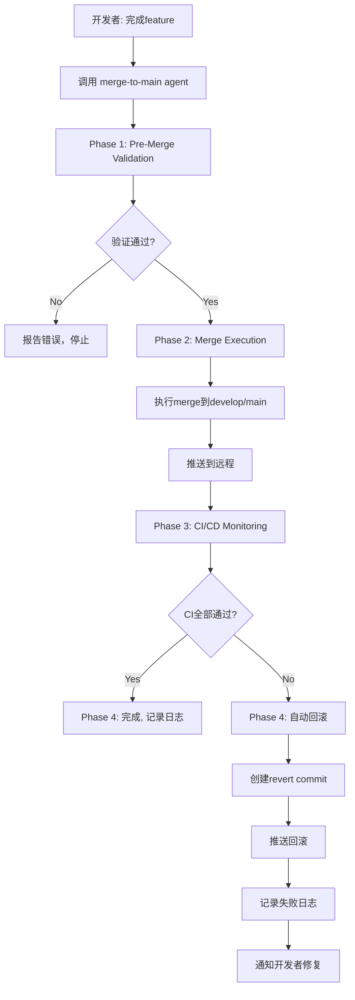

# Claude Code Agents 架构文档

本文档描述了DeepDive项目中Claude Code agent系统的整体架构和使用指南。

## 目录

- [概述](#概述)
- [系统架构](#系统架构)
- [可用的Agents](#可用的agents)
- [目录结构](#目录结构)
- [工作流程](#工作流程)
- [配置管理](#配置管理)
- [最佳实践](#最佳实践)
- [故障排查](#故障排查)

---

## 概述

DeepDive项目采用**专业化Agent系统**，将不同的开发任务委托给特定的sub-agents处理，每个agent专注于特定领域，提供专业化的自动化支持。

### 核心理念

```
主要目标：
✅ 自动化重复性任务
✅ 标准化开发流程
✅ 提高代码质量
✅ 确保主干稳定性
✅ 完整的操作审计
```

### Agent vs Scripts

| 特性           | Agent               | Scripts            |
| -------------- | ------------------- | ------------------ |
| **执行方式**   | Claude Code自动调用 | 手动执行           |
| **智能决策**   | ✅ 支持             | ❌ 无              |
| **上下文理解** | ✅ 理解项目状态     | ❌ 固定逻辑        |
| **错误恢复**   | ✅ 自动处理         | ⚠️ 需人工干预      |
| **适用场景**   | 复杂、需判断的任务  | 标准化、重复性任务 |

**最佳实践：** Agent调用Scripts执行具体操作

---

## 系统架构

```
┌─────────────────────────────────────────────────────────┐
│                    Claude Code                          │
│                 (主控制器/协调器)                         │
└──────────────────────┬──────────────────────────────────┘
                       │
                       │ 委托任务
                       ▼
        ┌──────────────────────────────────┐
        │      Specialized Agents           │
        │    (专业化Sub-Agents)              │
        └──────────────┬───────────────────┘
                       │
        ┌──────────────┼──────────────────┐
        │              │                  │
        ▼              ▼                  ▼
┌──────────────┐ ┌──────────────┐ ┌──────────────┐
│ merge-to-main│ │docs-specialist│ │  (future)    │
│              │ │              │ │              │
│ • 代码合并    │ │ • 文档管理    │ │ • 其他agent   │
│ • CI监控     │ │ • 质量检查    │ │              │
│ • 自动回滚    │ │ • 内容审核    │ │              │
└──────┬───────┘ └──────┬───────┘ └──────────────┘
       │                │
       ▼                ▼
┌─────────────────────────────────────────────┐
│              Scripts Layer                   │
│          (工具脚本执行层)                     │
│                                              │
│  scripts/                                    │
│  ├── merge-to-main/                          │
│  │   ├── pre-merge-validation.sh             │
│  │   ├── monitor-ci.sh                       │
│  │   └── rollback-merge.sh                   │
│  │                                           │
│  ├── docs-specialist/                        │
│  │   ├── docs-validation.sh                  │
│  │   └── check-file-naming.js                │
│  │                                           │
│  └── utils/                                  │
└─────────────────────────────────────────────┘
       │                │
       ▼                ▼
┌─────────────────────────────────────────────┐
│         Infrastructure Layer                 │
│         (基础设施层)                          │
│                                              │
│  • Git / GitHub                              │
│  • GitHub Actions (CI/CD)                    │
│  • GitHub CLI (gh)                           │
│  • Testing Framework (Jest/Vitest)           │
│  • Linters (ESLint, TypeScript)              │
└─────────────────────────────────────────────┘
```

---

## 可用的Agents

### 1. merge-to-main Agent

**用途：** 安全地将代码合并到主干分支，并监控CI/CD流程

**核心功能：**

- ✅ Pre-Merge Validation（代码质量、测试、提交规范）
- ✅ Merge Execution（安全合并、冲突处理）
- ✅ CI/CD Monitoring（实时监控GitHub Actions）
- ✅ Rollback & Recovery（失败自动回滚）
- ✅ Security & Audit（安全扫描、审计日志）

**配置文件：**

- Agent定义：`.claude/agents/merge-to-main.md`
- 配置：`.claude/config/merge-to-main.yml`
- 脚本：`scripts/merge-to-main/`

**使用场景：**

```bash
# 场景1：合并feature到develop
当你完成一个feature，想要合并到develop并确保CI通过

# 场景2：发布到production
当你要将develop合并到main并发布新版本

# 场景3：CI失败回滚
当合并后CI失败，需要自动回滚保护主干
```

**调用方式：**

```
# 在Claude Code中
"请帮我将当前分支合并到develop，并监控CI执行情况"
```

### 2. docs-specialist Agent

**用途：** 管理项目文档的全生命周期

**核心功能：**

- ✅ 文档分析与总结
- ✅ 文档编写与更新
- ✅ 质量检查（格式、链接、准确性）
- ✅ 命名规范验证
- ✅ 内容同步验证

**配置文件：**

- Agent定义：`.claude/agents/docs-specialist.md`
- 脚本：`scripts/docs-specialist/`

**使用场景：**

```bash
# 场景1：分析现有文档
"帮我分析docs/目录下的所有文档，找出缺失和问题"

# 场景2：更新API文档
"后端添加了新的API端点，请更新API文档"

# 场景3：验证文档规范
"检查所有文档是否符合命名规范和格式要求"
```

**调用方式：**

```
# 在Claude Code中
"请分析项目文档的完整性和准确性"
```

### 3. monitoring Agent

**用途：** 管理生产环境监控系统

**核心功能：**

- ✅ Monitoring Setup（自动化部署Prometheus、Grafana）
- ✅ Alert Management（配置和分析告警）
- ✅ Performance Analysis（性能分析和瓶颈识别）
- ✅ Health Check（服务健康检查）
- ✅ CI/CD Integration（集成到发布流程）

**配置文件：**

- Agent定义：`.claude/agents/monitoring.md`
- 配置：`.claude/config/monitoring.yml`
- 脚本：`scripts/monitoring/`

**使用场景：**

```bash
# 场景1：部署监控系统
"请帮我部署监控系统到staging环境"

# 场景2：检查当前告警
"帮我查看当前有哪些告警"

# 场景3：性能分析
"分析最近24小时的性能问题"

# 场景4：部署后验证
在merge-to-main流程中自动调用，验证部署后的健康状态
```

**调用方式：**

```
# 在Claude Code中
"请帮我部署监控系统并检查健康状态"
"分析最近的性能下降问题"
```

---

## 目录结构

```
deepdive/
├── .claude/                          # Claude Code配置根目录
│   ├── agents/                       # Agent定义
│   │   ├── README.md                 # 本文件
│   │   ├── merge-to-main.md          # Merge to Main Agent
│   │   ├── docs-specialist.md        # Docs Specialist Agent
│   │   └── monitoring.md             # Monitoring Agent
│   │
│   ├── config/                       # Agent配置
│   │   ├── merge-to-main.yml         # Merge to Main配置
│   │   └── monitoring.yml            # Monitoring配置
│   │
│   ├── logs/                         # 审计日志
│   │   ├── merge-audit.jsonl         # 合并审计日志
│   │   ├── merge-rollbacks.jsonl     # 回滚记录
│   │   ├── ci-monitoring.jsonl       # CI监控记录
│   │   └── pre-merge-validation-*.log # 验证报告
│   │
│   ├── tools/                        # Agent工具脚本（源文件）
│   │   ├── pre-merge-validation.sh
│   │   ├── monitor-ci.sh
│   │   └── rollback-merge.sh
│   │
│   └── standards/                    # 项目规范
│       ├── 08-git-workflow.md        # Git工作流规范
│       └── ...
│
├── scripts/                          # 可执行脚本（按功能组织）
│   ├── README.md                     # 脚本使用文档
│   │
│   ├── merge-to-main/                # 代码合并相关脚本
│   │   ├── pre-merge-validation.sh   # 合并前验证
│   │   ├── monitor-ci.sh             # CI监控
│   │   └── rollback-merge.sh         # 回滚工具
│   │
│   ├── docs-specialist/              # 文档管理脚本
│   │   ├── docs-validation.sh
│   │   └── check-file-naming.js
│   │
│   ├── monitoring/                   # 监控管理脚本
│   │   ├── setup-prometheus.sh
│   │   ├── health-check.sh
│   │   ├── check-alerts.sh
│   │   └── validate-config.sh
│   │
│   ├── local-server/                 # 开发环境脚本
│   │   ├── start-all.bat
│   │   └── stop-all.bat
│   │
│   └── utils/                        # 通用工具脚本
│
└── .github/
    └── workflows/
        └── ci.yml                    # CI/CD配置
```

### 目录说明

| 目录              | 用途                  | 谁使用           |
| ----------------- | --------------------- | ---------------- |
| `.claude/agents/` | Agent定义（Markdown） | Claude Code      |
| `.claude/config/` | Agent配置（YAML）     | Agent运行时      |
| `.claude/tools/`  | 脚本源文件            | 开发维护         |
| `.claude/logs/`   | 审计日志（JSONL）     | Agent + 人工审计 |
| `scripts/`        | 可执行脚本            | Agent + 手动执行 |

---

## 工作流程

### Merge to Main 完整流程



### 详细步骤

#### 1. Pre-Merge Validation（5-10分钟）

```bash
# 自动执行的检查
✓ Git状态检查
✓ 提交信息验证（Conventional Commits）
✓ 代码Lint检查
✓ TypeScript类型检查
✓ 单元测试执行
✓ 测试覆盖率验证（≥85%）
✓ 合并冲突检测
✓ 敏感信息扫描
```

#### 2. Merge Execution（1-2分钟）

```bash
# Agent询问用户
? Target branch: develop / main
? Continue with merge? (yes/no)

# 执行merge
git checkout develop
git pull origin develop
git merge --no-ff feature/xxx
git push origin develop
```

#### 3. CI/CD Monitoring（10-15分钟）

```bash
# 实时监控GitHub Actions
[1/5] quality-check .......... ✅ PASSED (2m 15s)
[2/5] backend-test .......... ✅ PASSED (3m 42s)
[3/5] frontend-test ......... ✅ PASSED (2m 58s)
[4/5] build ................. ✅ PASSED (4m 10s)
[5/5] success ............... ✅ PASSED

✅ All CI Checks Passed!
```

#### 4. Rollback (如果CI失败)

```bash
❌ CI Pipeline Failed!

Failed Job: backend-test
Error: Test suite failed

⏪ Automatic Rollback
🔄 Reverting merge commit...
✅ Rollback successful
```

---

## 配置管理

### merge-to-main.yml 配置详解

```yaml
# .claude/config/merge-to-main.yml

# 核心配置
merge:
  allowed_targets: [develop, main] # 允许的目标分支
  strategy: no-ff # 合并策略
  require_review:
    develop: false # develop不强制PR审核
    main: true # main必须经过PR审核

# CI监控
ci_monitoring:
  enabled: true # 启用CI监控
  timeout:
    total: 15 # 总超时15分钟

# 回滚策略
rollback:
  auto_rollback: true # CI失败自动回滚
  method: revert # 使用revert（保留历史）

# 安全配置
security:
  scan_secrets: true # 扫描敏感信息
  forbidden_files:
    - "*.env"
    - "*.pem"
    - "credentials.json"
```

### 自定义配置

**修改超时时间：**

```yaml
ci_monitoring:
  timeout:
    quality_check: 10 # 增加到10分钟
    backend_test: 15
    total: 30 # 总共30分钟
```

**禁用自动回滚：**

```yaml
rollback:
  auto_rollback: false # 需要人工决定是否回滚
```

**添加通知：**

```yaml
rollback:
  notification:
    slack_webhook: "https://hooks.slack.com/..."
    email:
      enabled: true
      recipients:
        - "team@example.com"
```

---

## 最佳实践

### 1. 日常开发流程

```bash
# 1. 创建feature分支
git checkout -b feature/001-add-rss-parser

# 2. 开发 + 提交（遵循Conventional Commits）
git commit -m "feat(crawler): add RSS parser"

# 3. 本地测试
npm run lint && npm test

# 4. 准备merge前，先本地验证
./scripts/merge-to-main/pre-merge-validation.sh develop

# 5. 使用agent执行merge
# 在Claude Code中: "请将当前分支合并到develop并监控CI"

# 6. Agent自动执行：
#    - Pre-merge验证
#    - 执行merge
#    - 监控CI
#    - 如失败自动回滚
```

### 2. 发布到Production

```bash
# 1. 确保develop所有测试通过
./scripts/merge-to-main/monitor-ci.sh develop

# 2. 创建release分支
git checkout -b release/v1.2.0

# 3. 更新版本号、CHANGELOG
# ... 编辑文件 ...
git commit -m "chore(release): prepare v1.2.0"

# 4. 使用agent合并到main
# "请将release/v1.2.0合并到main并打tag"

# 5. Agent确认：
#    - PR是否已审核？✓
#    - develop测试是否通过？✓
#    - 版本号？v1.2.0
```

### 3. 紧急修复（Hotfix）

```bash
# 1. 从main创建hotfix分支
git checkout main
git pull origin main
git checkout -b hotfix/fix-critical-bug

# 2. 修复 + 测试
# ... 修复代码 ...
git commit -m "fix(auth): resolve security vulnerability"

# 3. 合并到main
# "请将hotfix分支合并到main并同步到develop"

# 4. Agent执行：
#    - 合并到main
#    - 监控CI
#    - 同时合并到develop
#    - 打tag（如v1.2.1）
```

### 4. CI失败处理

```bash
# 场景：merge后CI失败，agent自动回滚

# 1. 查看失败日志
./scripts/merge-to-main/monitor-ci.sh logs

# 2. 在feature分支修复
git checkout feature/xxx
# ... 修复代码 ...
git commit -m "fix(backend): resolve test failure"

# 3. 再次验证
./scripts/merge-to-main/pre-merge-validation.sh develop

# 4. 重新merge
# "请再次尝试合并到develop"
```

---

## 故障排查

### 问题1: Agent无法调用脚本

**症状：**

```
Error: scripts/merge-to-main/pre-merge-validation.sh: Permission denied
```

**解决：**

```bash
# 添加执行权限
chmod +x scripts/merge-to-main/*.sh
chmod +x scripts/docs/*.sh
```

### 问题2: GitHub CLI未认证

**症状：**

```
Error: gh not authenticated
```

**解决：**

```bash
# 安装GitHub CLI
# https://cli.github.com/

# 认证
gh auth login
```

### 问题3: CI监控超时

**症状：**

```
Timeout: Workflow did not complete in 900s
```

**解决：**

```yaml
# 修改 .claude/config/merge-to-main.yml
ci_monitoring:
  timeout:
    total: 1800 # 增加到30分钟
```

### 问题4: 回滚失败

**症状：**

```
Error: Revert failed - conflicts detected
```

**解决：**

```bash
# 手动解决冲突
git status
# 编辑冲突文件
git add .
git revert --continue
```

### 问题5: 提交信息不符合规范

**症状：**

```
Error: Invalid commit message format
```

**解决：**

```bash
# 修改最后一次提交信息
git commit --amend -m "feat(module): add feature"

# 或使用交互式rebase修改历史提交
git rebase -i HEAD~3
```

---

## 扩展Agent系统

### 添加新Agent

**步骤：**

1. **创建Agent定义**

```bash
# 创建 .claude/agents/new-agent.md
---
name: new-agent
description: 新agent的描述
tools: Read, Write, Bash, ...
model: sonnet
---

# 新Agent

## 核心职责
...
```

2. **创建配置文件**

```bash
# 创建 .claude/config/new-agent.yml
# 配置项...
```

3. **创建脚本目录**

```bash
mkdir -p scripts/new-agent
# 添加脚本
```

4. **更新文档**

```bash
# 更新本README
# 更新scripts/README.md
```

### 建议的未来Agents

| Agent名称              | 用途                   | 优先级 |
| ---------------------- | ---------------------- | ------ |
| `test-runner`          | 自动化测试执行和报告   | High   |
| `security-scanner`     | 安全漏洞扫描和修复建议 | High   |
| `performance-analyzer` | 性能分析和优化建议     | Medium |
| `dependency-manager`   | 依赖更新和漏洞修复     | Medium |
| `release-manager`      | 自动化发布流程         | Low    |

---

## 审计与合规

### 审计日志

所有agent操作都记录在`.claude/logs/`：

**merge-audit.jsonl 格式：**

```json
{
  "timestamp": "2025-11-23T14:30:00Z",
  "user": "developer@example.com",
  "action": "merge",
  "source_branch": "feature/001",
  "target_branch": "develop",
  "merge_commit": "abc123",
  "ci_status": "success",
  "rollback": false
}
```

**查询示例：**

```bash
# 查看所有merge记录
cat .claude/logs/merge-audit.jsonl | jq .

# 查看失败的merge
cat .claude/logs/merge-audit.jsonl | jq 'select(.rollback == true)'

# 统计最近7天的merge次数
cat .claude/logs/merge-audit.jsonl | \
  jq -r '.timestamp' | \
  grep $(date -d '7 days ago' +%Y-%m) | \
  wc -l
```

### 合规性检查

**每月审计清单：**

- [ ] 审查所有merge操作（`merge-audit.jsonl`）
- [ ] 检查回滚记录（`merge-rollbacks.jsonl`）
- [ ] 验证CI成功率（`ci-monitoring.jsonl`）
- [ ] 检查是否有未授权的强制推送
- [ ] 验证main分支的所有提交都经过PR审核

---

## 相关文档

- [Git工作流规范](../standards/08-git-workflow.md)
- [脚本使用文档](../../scripts/README.md)
- [CI/CD配置](../../.github/workflows/ci.yml)
- [项目规范总览](../standards/00-overview.md)

---

## 反馈与改进

**遇到问题？**

- 提交Issue到项目仓库
- 联系DevOps团队

**改进建议？**

- 提交PR修改agent定义
- 更新配置文件
- 贡献新的脚本

---

**版本：** 1.0
**最后更新：** 2025-11-23
**维护者：** DevOps Team
